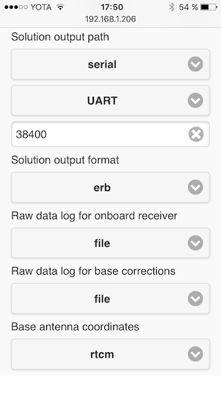

### APM integration

Since ReachView version **0.3.0** Reach supports RTK-enhanced coordinates output to Navio and Pixhawk autopilots.

#### Connecting Reach to Pixhawk

To provide RTK solution to Pixhawk, Reach needs to be connected via a serial port. You can do that by plugging the serial cable into Reach's upper DF13 port and Pixhawk's "Serial" connector.

#### Configuring Reach to output solution to Pixhawk

Communication is done via the serial port we connected earlier. To configure Reach to use this port, do the following:

* Go to Solution output path(either 1 or 2)
* Select Serial
* Choose UART as the serial device
* Choose the desired baud rate(38400 for default)
* Choose ERB as solution output format

ERB is a custom protocol, used to send location data to the autopilot.

#### Setting up a correction link between a base station and drone-mounted rover

In general, there are two ways of creating a correction link between a ground base station and Reach, mounted on a drone:

* Two links: one for telemetry and one for RTK corrections
* Use telemetry link and inject RTK corrections into it
