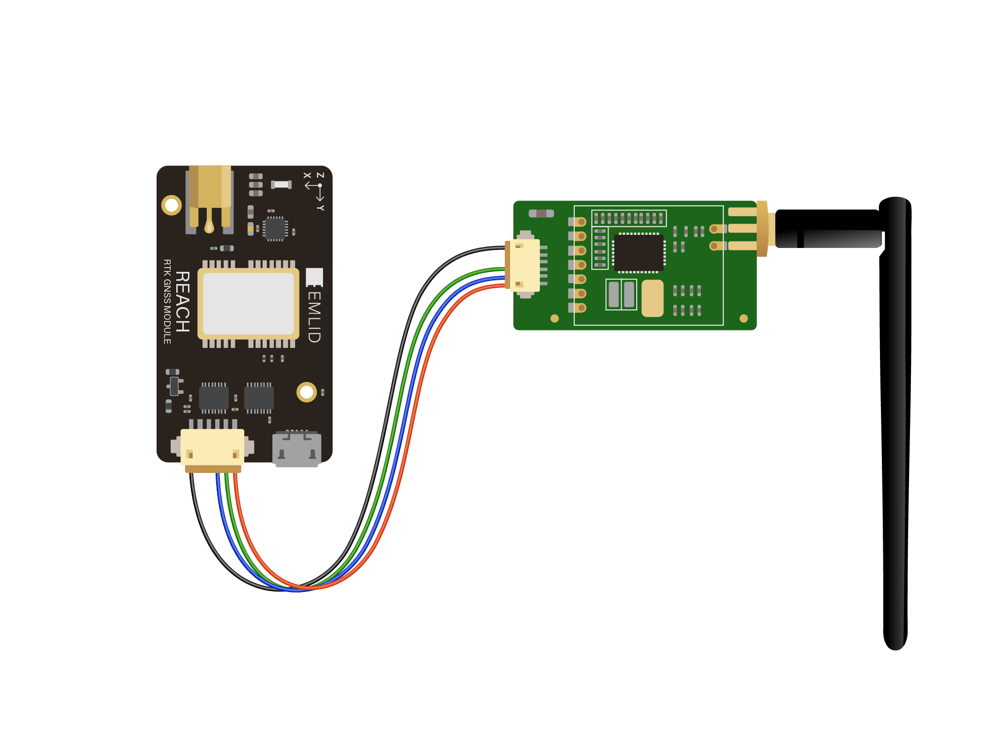
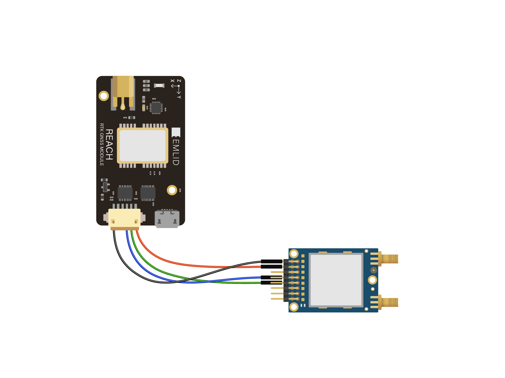

#### Radio

It is possible to connect radio modules to Reach in order to obtain corrections or send calculated coordinates.

Most radios nowadays use UART or USB as a connection.

##### Connecting UART radio

Logic level on UART in Reach is 3.3V but pins are 5V tolerant, so you can use both 3.3V and 5V logic level radios.

UART radio is accessible on Reach as a serial device with the name **ttyMFD2**

To connect UART radio to Reach use upper DF13 port (the one near the USB).

| Reach pins | Radio pins |
|:----------:|:----------:|
|     +5V    |     +5V    |
|     TX     |     RX     |
|     RX     |     TX     |
|     GND    |     GND    |

###### 3DR Radio

DO NOT CONNECT 3DR RADIO TO REACH WITH DF13-TO-DF13 CABLE FROM THE PACKAGE, IT CAN CAUSE DAMAGE TO THE RADIO.

Connection diagram for 3DR Radio v2:

3DR Radio can also be connected over USB.

###### RFD900 Radio

Connection diagram for RFD900 radio:

Please mind that RFD can consume up to 800ma in peaks so make sure that your power source can provide enough power for both Reach and RFD900.

##### Connecting USB radio

To connect USB radio to Reach use USB-OTG cable provided with the package.
Plug radio into USB-F port and plug Micro-USB end of the cable in Reach.
When using USB port in OTG mode Reach has to be powered over one of the DF13 ports.

USB radio is accessible on Reach as a serial device with the name **ttyUSB0**

#### Pixhawk autopilot

**[Integration of Reach RTK module with Pixhawk is a work in progress, instructions coming soon]**

#### Camera

**[Integration of Reach RTK module with cameras is a work in progress, instructions coming soon]**
