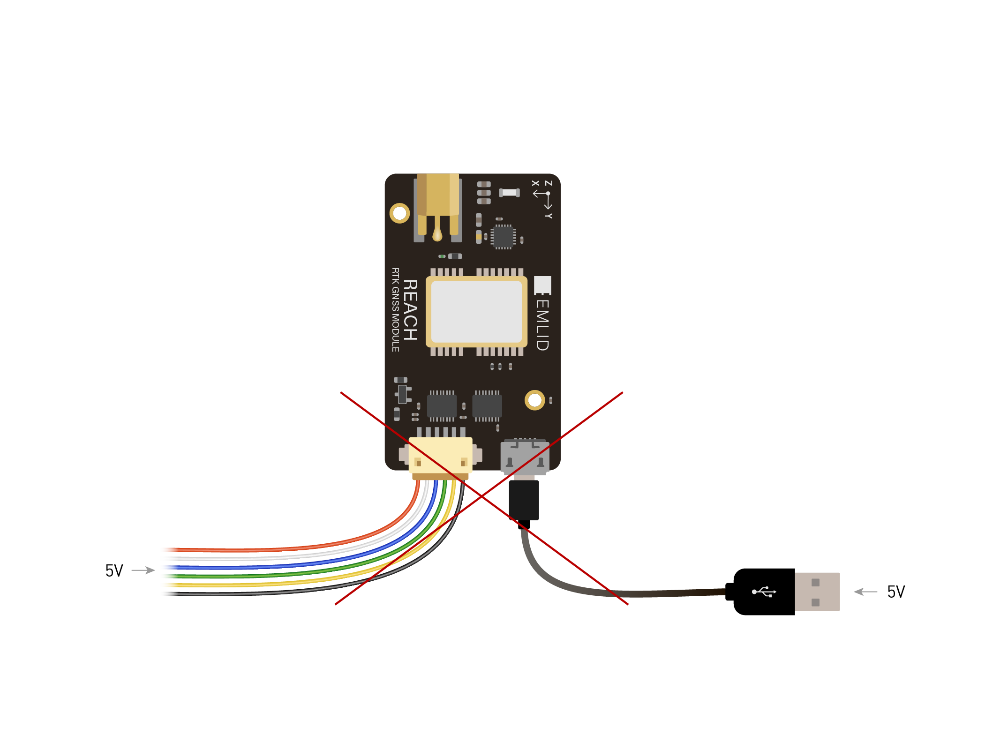
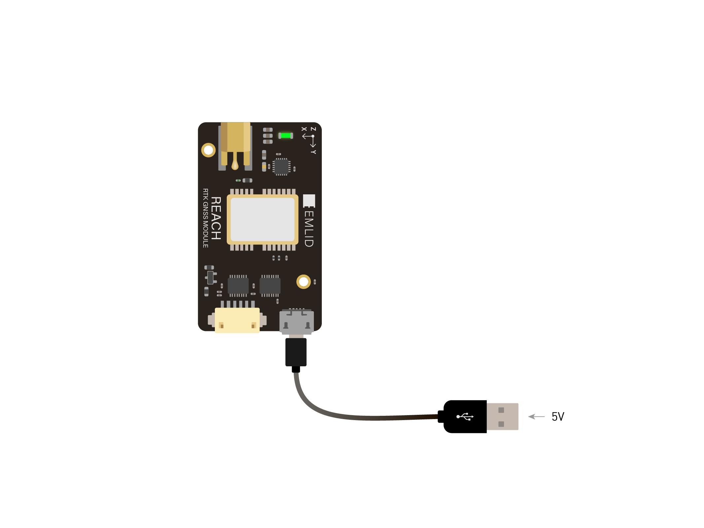
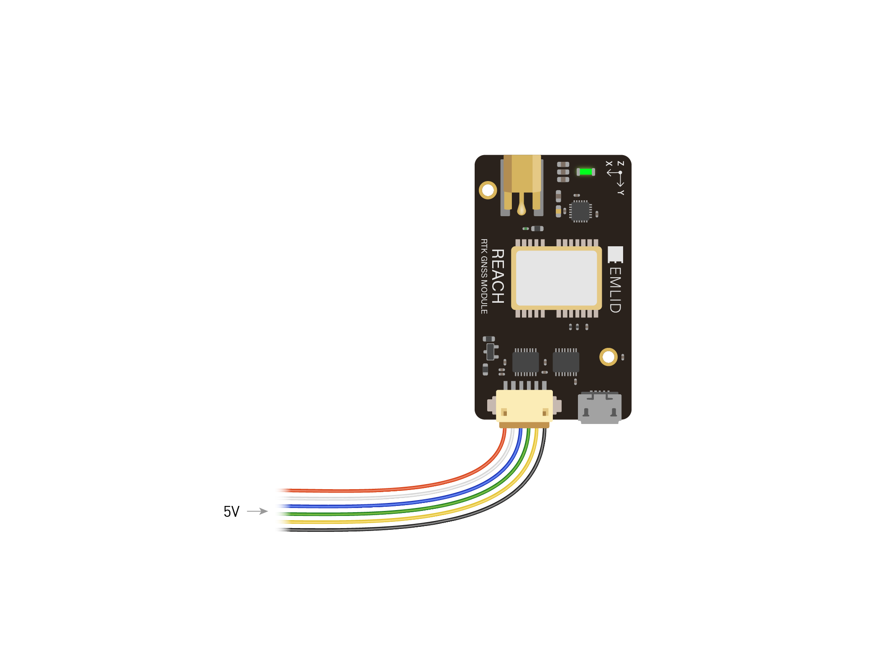

### How to power Reach RTK

Emlid Reach RTK module can be powered using Micro-USB port or DF13 ports. Power circuit is shared for all ports, so when you power the device over one port it will pass power to other ports.

> **IMPORTANT**

> Do not plug two power supplies at the same time as it may damage the device.

### Power supply over USB

You can power Reach over Micro-USB cable using power supplies like:

* Power bank
* USB wall adapter
* Computer USB ports

### Powering using DF13 ports

Reach can be powered by providing 5 Volts to corresponding pins on any of the two DF13 ports.

When Reach is powered over DF13 port it will pass power to devices connected to Micro-USB OTG port such as flash drives, 3G\4G modems, USB radios etc.

