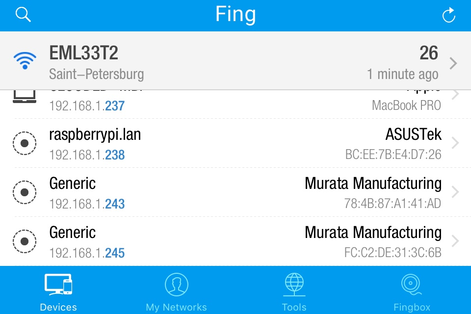
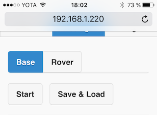
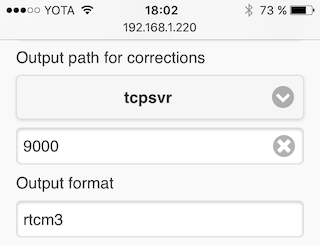
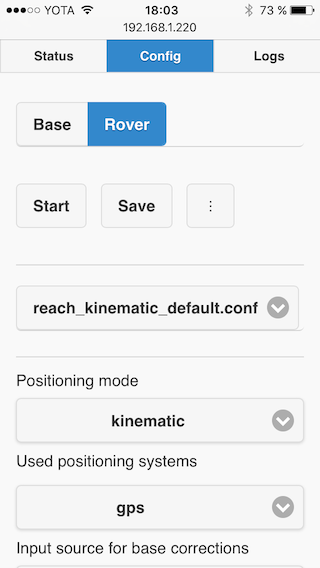
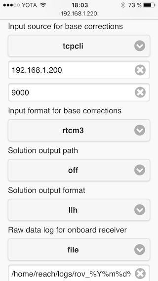
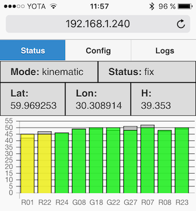
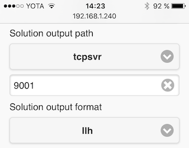
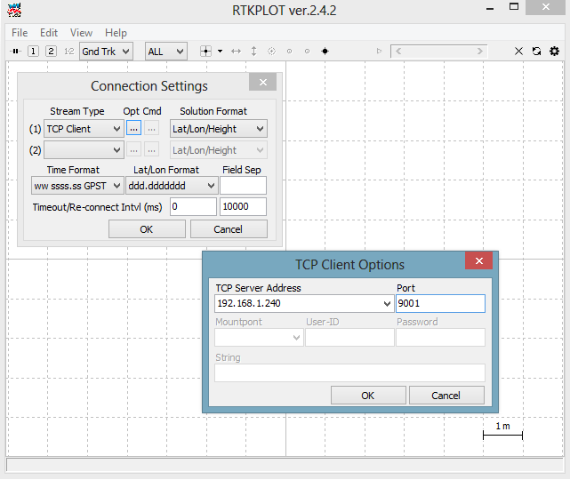

### Intro

In this quick tutorial we will show you how to two set up two Reach devices as a base and a rover with correction link over Wi-Fi.

> **If you encounter any issues performing these steps, please take a look at our [troubleshooting guide](troubleshooting.md). If your problem is not covered, we will be happy to help at our [community forums](http://community.emlid.com/).**

This tutorial only covers on use case. To get more information, follow these links:

* [Mechanical specs](mechanical-specs.md)
* [Electrical specs](electrical-specs.md)
* [Hardware integration](hardware-integration.md)
* [ReachView app](reachview-basics.md)

### Powering up

Take Micro-USB<-->USB cable that is coming with the package. Plug Micro-USB end of the cable into Micro-USB port on Reach and plug another end into 5V power source such as USB power bank, USB wall adapter or USB port of a computer.

More on power supply [here](power-supply.md).

### Connecting and placing antenna

Plug antenna cable into MCX socket on Reach. Place antenna on a ground plane. It could be a cut piece of metal > 100mm in diameter, roof of a car or metal roof of a building. There should be no obstacles near the antenna that could block the sky view higher than 30 degrees above horizon.

> Do not test the device indoors or near buildings, do not cover the skyview for the antennas with laptops, cars or yourself. RTK requires good satellite visibility and reception.

A guide how to properly place the antennas is available in [Antenna Placement](antenna-placement.md) section.

### Connecting to Reach

When Reach is powered for the first time it will create a Wi-Fi hotspot. Open a list of Wi-Fi networks on your smartphone, tablet or laptop and connect to a network named "reach:part_of_mac_address". For example, **reach:66:ac**. The network password is "**emlidreach**".

> If this password is not accepted, probably your Reach has been flashed with a bugged firmware, please [reflash](firmware-reflashing.md) with the latest image.

### Setting up Wi-Fi

After connecting to the network hosted by reach, open a web browser on your smartphone, tablet or laptop and type either **http://reach.local:5000** or **http://192.168.42.1:5000** in the address bar. Enter your Wi-Fi network (e.g. a hotspot on your smartphone) "mywifinetwork" and enter a password. Hit submit and wait for about a minute. Reach will disable its own hotspot and try to connect to your Wi-Fi network.

Note that after hitting "Submit" a **progress bar** will appear. You **should not** wait for the progress bar to reach it's end. **That sometimes ends with an error message which is irrelevant and misleading**. Moreover, sometimes, due to ".local" name resolving problems, the **bar does not really start to go at all**. Don't wait for more than 30 seconds, as it's usually more than enough for the device to reconnect to a new network.

***Perform all previous steps for both Reach devices.***

### Accessing Reach device in a network

After connecting Reach devices to an existing Wi-Fi network, you will need to identify their IP's. For this you can use a smartphone app "Fing", "nmap" on Linux/OS X and Zenmap on Windows. Reach will show up as "Murata manufacturing" device in these apps.

If your device supports Bonjour discovery, you can access Reach with "reach.local" address. However, with two devices on the network only one will respond to "reach.local".

Read more on resolving IP addresses in the [ReachView section](reachview-basics.md).

### Working with ReachView app

#### Interface walkthrough

Open a web browser on your smartphone, tablet or laptop and type IP address of Reach in the address bar. ReachView consists of three main tabs: **Status**, **Config**, **Logs**. **Status** will show current satellite levels, solution status and coordinates. **Config** tab is used to set RTK parameters like positioning mode, set correction input interfaces and more. **Logs** tab keeps links to raw data logs, stored on the device and keeps the self-update button. By default, Reach starts as a rover and is stopped.

#### Updating ReachView

To do this, make sure Reach is connected to a Wi-Fi network with Internet access. Go to the Logs page and press the **Update** button. ReachView will go inactive for about a minute. To reconnect, close the current tab and try to open ReachView in a new one. It is preferred to use Reach's IP address instead of **reach.local** to connect after an update.

***Perform the update for both Reach devices.***

From this point, it is considered that you performed the update.

#### Setting up base station

Connect to Reach you want to use as a base. Navigate to Config tab and choose **Base** in the upper selector. Wait for the app to fetch current base settings. The settings include: base coordinates, input stream, output stream and RTCM3 messages to be used.

By default, base output stream will be available on a TCP port 9000.

Hit the **Start** button.

#### Setting up rover

Connect to the second Reach. Navigate to **Config** tab and choose **Rover** mode in the upper selector. Wait for the app to fetch current rover settings. Choose **reach_kinematic_default.conf** from the configuration file list.

Now, you need to change base station connection settings. Make sure that "Input source for base corrections" is set to **tcpcli** (TCP client) and enter base Reach's IP address to the address window. Default port is 9000.

Hit the **Save** button. Click "Yes" to load current settings. The rover mode will start.

#### Keeping the settings

After configuration, Reach will remember it's settings and start in this state on boot. For example, device configured as Rover with "reach_single_default.conf" configuration file, started, will start Rover with the same config after a power cycle. Base mode will also keep it's settings and started/stopped state.

If, for some reason, Reach is rebooted during configuration process, the settings file might get corrupted. Then, by default Reach will start as a stopped Rover with "reach_single_default.conf" settings.

#### Viewing results

##### ReachView status

Go to **Status** tab of the app on the rover device. You can see a bar chart with satellite levels, current coordinates in llh format, positioning mode and solution status. In this quick tutorial, positioning mode is set to "Kinematic" which is the main RTK mode.

If everything has been set up correctly, you will see changes in the solution status box. You will see the statuses in the following order:

* **"-"**. This means there is no information for the software to process. Either not enough time has passed or the antenna is not placed correctly.
* **single**. This is usually the state that follows **"-"** in RTK mode. **Single** means that rover has found a solution relying on it's own receiver and base corrections are not taken into consideration yet. If rover is started in single mode, this will also be the result.
* **float**. The base corrections are now taken into consideration and positioning is relative to base coordinates, but the integer ambiguity is not resolved.
* **fixed**. Positioning is relative to the base and the integer ambiguity is properly resolved. This is as good as it gets, **fix** solution status indicates high level of positioning precision.

If you see **float** or **fixed** solution status, RTK is set up correctly.

Remember that satellite levels and therefore antenna placement severely affect RTK performance. You need at least 5 satellites with SNR levels over 45(marked green on the chart) to get RTK improved solution.

##### RTKPLOT

You can view your solution in real time with RTKLIB's RTKPLOT(requires a Windows PC).

First, we need to configure solution output. Go to rover's **Config** tab, and make solution output a TCP server, just like with the base output stream. Make sure output format is **llh**.

Now, open RTKPLOT and change connection settings to be a TCP client(File -> Connection settings). Enter rover's IP address and the port you entered to solution output settings.

Connect using File -> Connect

### More reading

Congratulations on finishing the quickstart tutorial! Continue to learn about setting up different correction links in the [ReachView section](reachview-basics.md).
