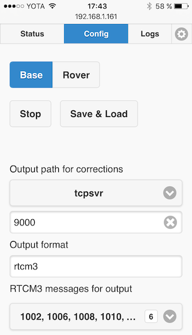
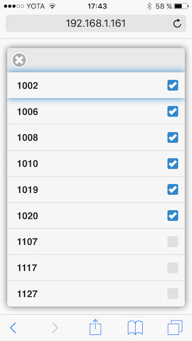
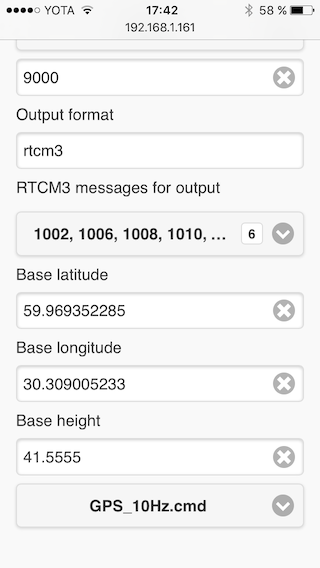

### Base mode capabilities

At the moment, base mode capabilities are limited to outputting the corrections to a single destination. However, multiple outputs, as well as satellite levels and automatic average base position are in our [roadmap](roadmap.md).

### Base configuration

**Base** mode allows Reach to send RTK corrections. To configure Reach as a Base, go to **Config** tab and choose **Base** in the upper selector.

Base mode has significantly less settings. It also does not use configuration files. Let's take a look at the **Config** tab:

#### Base parameters

##### Output destination

> Reach in base mode only supports **RTCM3** data output.

There are several ways to stream base corrections:

* Serial connection
* TCP connection
* File

You can read about the first two in the [correction link](reachview-link.md) section. The file option will store a log on the device. Once you stop the base, it will be available in the **Logs** tab as a **"Base"** log.

##### RTCM3 messages

You can configure which RTCM3 messages to send. This may be helpful if your correction link cant handle the data load. Full message description can be found here [here](http://www.geopp.com/pdf/gppigs06_rtcm_f.pdf).

The minimal messages, required for RTK are **1002** and **1006**. They contain GPS L1 observations(extended data) and base antenna coordinates(extended data). If you wish to add GLONASS L1 observations, use **1010** as well.

Here is an estimation of bps with base update frequency set to 1 Hz:

| RTCM3 messages   | Data rate, bps |
|------------------|----------------|
| 1002, 1006       | 1150           |
| 1002, 1006, 1010 | 1880           |
| All available    | 2664           |

For higher frequencies, multiply the data rate by the number of Hertz.

##### Base coordinates

**This is a key point in getting good results**. Reach in base mode needs to know its coordinates. Best practice is setting up base on a well-known position (coordinates determined by RTK) as this directly affects positioning results.

Why are base coordinates so important?

To achieve **good absolute positioning** results on the rover, base needs to know its position accurately. RTK algorithms calculate a vector pointing from base's location (basically, the coordinates you enter here) to rover. Then, rover's absolute position is determined using this vector and base coordinates. That means that rover's **absolute** position will be just as accurate as the base's **absolute** coordinates.

However, if you are only interested in rover's **relative** position accuracy, you may use a less accurate position for the base.

