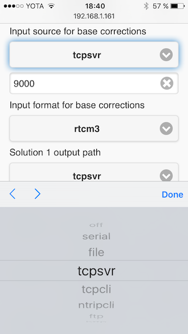
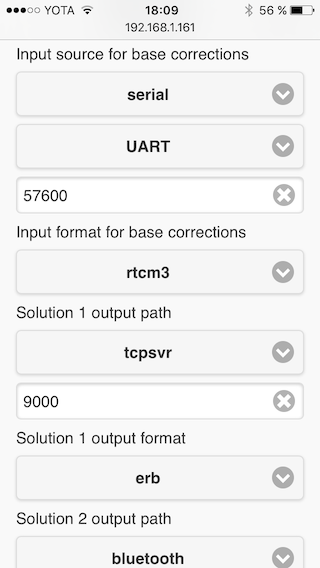
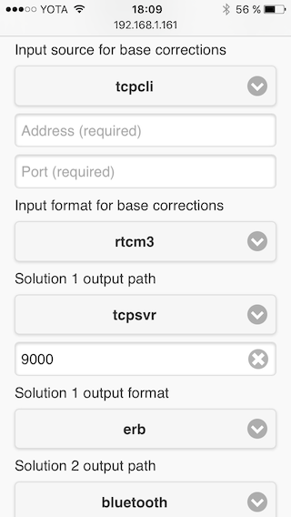
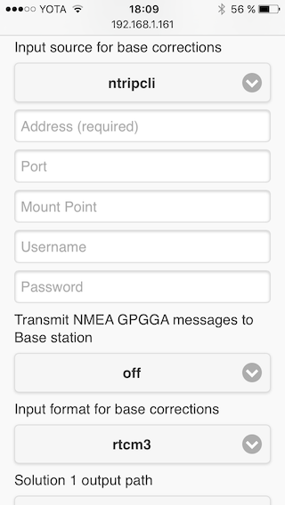

### Receiving base corrections

Reach supports various ways to receive corrections. The built-in **Wi-Fi**, **UART** and **USB OTG** interfaces allow several setups. This article will show you how to configure Reach to make use of all these connectivity options.

#### Configuring correction link

In ReachView, go to the **Config** tab, then look for a setting called **"Input source for base corrections"**. Click on the selector and you will see available options.

Under **"Input format for base corrections"** you can see the supported correction formats. They include **RTCM 2.3(rtcm2), RTCM 3.2(rtcm3), NovAtel OEM4/OEM6(oem4), NovAtel OEM3(oem3), UBX(ubx), NovAtel Superstar II(ss2), Hemisphere(hemis), SkyTraq(skytraq), SP3(sp3)**.

#### Radio and other serial devices

Reach has two serial interfaces available - **UART** on the **DF13** connector and **USB OTG**. Radio connection details can be found [here](hardware-integration.md).

To use these interfaces as a source of base corrections, choose the **"Serial""** option in the dropdown menu. Next, choose whether it's the **UART** device or a **USB serial** device.

> USB option will only appear if you have a USB device connected. You might need to refresh the page after connecting.

The last value is the baud rate. ***The baud rate must be the same on Reach and the target device***.

#### TCP server and client

Using local network is a very easy and versatile option. Reach provides two modes: Tcp server and TCP client. The server will listen for incoming connections on a chosen port, while the client will continuously will try to connect to the specified address and port combination.

#### NTRIP client

NTRIP, or Networked Transport of RTCM via Internet Protocol, is a protocol, used by many publicly available(and sometimes free)base stations to stream RTCM corrections over the Internet. ***This type of corrections requires Reach to have an Internet connection***.

> Always check the distance to your NTRIP provider's receiver. The 10km baseline limitation is still operative with the NTRIP corrections.

Typically, connecting to a NTRIP caster will require several pieces of information: **IP address**, **port**, **mount point**, **username** and an optional **password**.

Note the **"Transmit NMEA GPGGA messages to Base stations"** option. This is required by some NTRIP casters for a feature called **Virtual Reference Station**. **VRS** will emulate a base station close to the Rover device depending on it's position. To enable this, choose **"single"**. You can also manully set a fixed position with the **"llh"** option.

