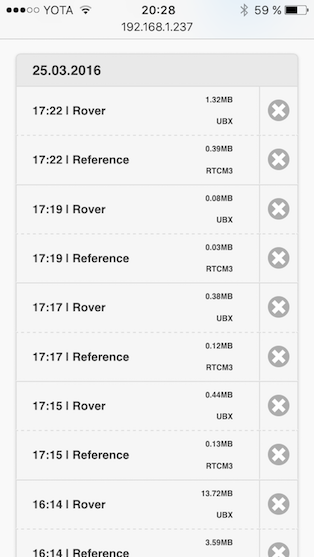
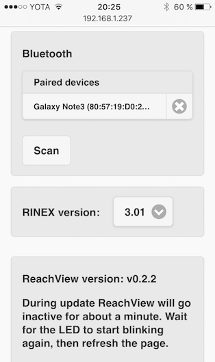
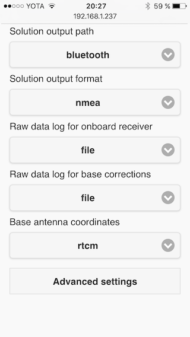

### Solution output and logging

In Rover mode, Reach supports outputting two types of data: **raw data logs** and processed **solution**.

**Raw data logs** contain all the messages sent by base and rover receivers. These logs can be used later for **post-processing**.
By default, all raw data logs are saved as files on the device and are available for download on ReachView's **Logs tabs**.

On the contrary, **solution** is a stream of already processed and enhanced coordinates. Available solution formats include LLH, XYZ, NMEA and ENU. Solution can be used for **plotting a track** with RTKLIB's RTKPLOT.

### Logging options

Raw data logs have several destinations available:

* **File**. Logs are to be saved on device directly
* **TCP server or client**. This can be used if you are interested in remote network logging
* **Serial**. You can direct the log stream to a UART or USB serial device, like a radio
* **Bluetooth**. Bluetooth can also be used to output raw data

##### Logging to a file

Naturally, logging to a file is the most common use case. With "Raw data log" options set to **file**, Reach will start logging as soon, as you press start in Rover mode and will continue, until you stop it or Reach will be powered down.

All logs, written to a file, are available in the logs tab. Clicking a log in the list will first convert the raw log to **RINEX**, then download it. Although Reach is based on a powerful dual-core x86 processor, log conversion may take a little while.
Cross button on the right will delete the log from device.

During the conversion process you will see a countdown timer. For really big logs, conversion can take unreasonably long time. To handle this, the **delete button becomes cancel**. If you hit **cancel**, conversion will stop and log will be downloaded as it is.

Note that you can change RINEX version to convert to in the **settings tab**.

### Solution output options

> Solution output allows RTK enhanced coordinates to be passed on in **llh, xyz, enum, nmea and erb** formats

Just as with raw data logging, solution can be directed to the same destinations

* **File**. Solution files are also available via the logs tab
* **TCP server or client**. A nice way to monitor your results is connecting via RTKPLOT later
* **Serial**. USB or UART serial devices, like 3DR radio
* **Bluetooth**. This is a special option as it allows **Reach solution to be used on Android devices as a location source**. This is known as "mock location".

##### Passing RTK solution to an APM autopilot

> Since ReachView version **0.3.0** Reach adds support to output RTK solution to Navio and Pixhawk autopilots

To do this, simply select **erb** solution output **format** in the ReachView configuration tab. Read more on APM integration here.

##### Bluetooth output and Android mock location

Since version **v0.2.2** of ReachView, you can choose bluetooth as an output for both raw logs and solution. A big thank you goes to our forum user [TB_RTK](https://community.emlid.com/users/tb_rtk/activity), who proposed an overview of Reach-compatible apps in [this thread on the forum](https://community.emlid.com/t/reach-bluetooth-related-and-app-talk/2156). We provide a guide on how to use Reach with several **free** Android apps:

* [Lefebure NTRIP caster](https://play.google.com/store/apps/details?id=com.lefebure.ntripclient) by Lefebure Design
* [Bluetooth GPS Provider](https://play.google.com/store/apps/details?id=de.mobilej.btgps&hl=en) by mobile-j.de
* [Bluetooth GPS](https://play.google.com/store/apps/details?id=googoo.android.btgps&hl=en) by GG MobLab

To use Reach with any of these apps you will need to do the following:

* Pair your Android device with Reach.

To do this, make your device discoverable. Then, go to the **Settings tab** and hit scan in the bluetooth section. Once your device appears in the "discoverable" section, hit it to send a pairing request. Accept the pairing request on your device. Your device will appear in the "paired devices section".

* Set "Solution output" to bluetooth and "Solution format" to **NMEA**. Save & Load the new rover settings

###### Lefebure NTRIP caster

Despite being called an NTRIP caster this app allows NMEA data input via bluetooth as well. Also, it supports Android feature called **mock location**, which allows to substitute your device's built-in GPS receiver with an external location provider, Reach in our case.

To connect Reach, do the following:

* Open the app, go to the settings(gear in the upper right corner)

* Then - receiver settings

Inside receiver settings:

* Change Bluetooth device to the Reach you are paired with
* Change Bluetooth Connection Method to **Secure via Reflection**
* Enable **Mock location** if you need to

* Go back to the main screen, hit **Connect** and watch the connection!

###### Bluetooth GPS Provider

* Open **Bluetooth GPS Provider**. Go to the settings.

* Choose a bluetooth device:

* Go back to the main screen and hit start button in the bottom right corner and watch the connection!

###### Bluetooth GPS

> Bluetooth GPS app is known to round up the NMEA coordinates Reach provides, so RTK accuracy is wasted when using it. You can still use it for **Android mock location**.

* Open up **Bluetooth GPS** and go to the settings. To connect to Reach, you will need to set an option called "Connection workaround"

* Go to the main screen, choose "reach" in the device list and hit "Connect"

* Enjoy Reach data on your phone!

