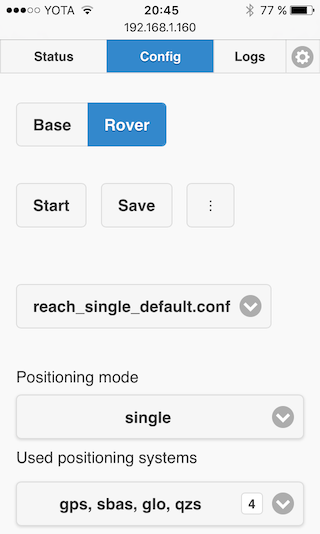
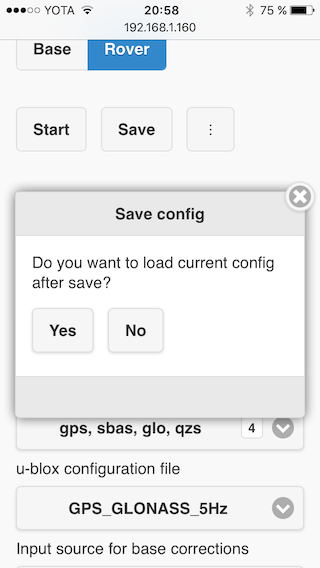

### Rover configuration

In RTK terminology, **Rover** is the receiver that moves and gets it's coordinates enhanced via corrections coming from a **Base** unit. To configure Reach as a Rover, navigate to **Config** tab and choose **Rover** mode in the upper selector. Wait for the app to fetch current rover settings.

##### Working with configuration files

Rover unit does all the RTK-related calculations and therefore has a lot of settings. These settings are organized into configuration files, which can be browsed in the **Config** tab of ReachView. Some of them are available directly below the config selector, the rest hidden under an **Advanced settings** button at the bottom.

On the screenshot below you can see Reach in rover mode with "reach_single_default.conf" config file chosen.

Reach comes with several predefined, default configs, which are updated regularly. You are free to edit and use them, however they will be reset with each update.

The three-dot menu provides some additional functionality with these files, such as an ability to reset a config to default or copy it using **Save as...**.

> Selecting a different config file does not mean it's loaded on the device.

**To load a configuration file to Reach**, press "**Save**" and then "**Yes**" in the pop-up window.

#### Rover parameters

##### RTK & GNSS parameters

* Positioning mode
    * Single. The result relies only on the on-board GPS unit. Base corrections will not be used in positioning
    * Kinematic. Base corrections will be used to improve positioning. The rover is assumed to be moving. **This is the main RTK mode**
    * Static. Base corrections will be used to improve positioning. The rover is assumed **not** to be moving.
* Used positioning systems. Choose what systems will be used by the RTK engine.
* u-blox configuration file. Configure onboard receiver modes, including update rate and GNSS systems.
* Base antenna coordinates(found down below). Rover needs to know the base station's location, and here you can change the source of this information. By default, it is the base station's RTCM3 stream.

##### Correction link and outputs

These settings are described in the next chapters, [here](reachview-link.md) and [here](reachview-output.md).

##### Advanced settings

Under **Advanced settings** you can see much more parameters for fine-tuning RTK performance.

You can read everything about these settings in [RTKLIB docs](http://www.rtklib.com/rtklib_document.htm) in section "Configure Positioning Options for RTKNAVI and RTKPOST".
