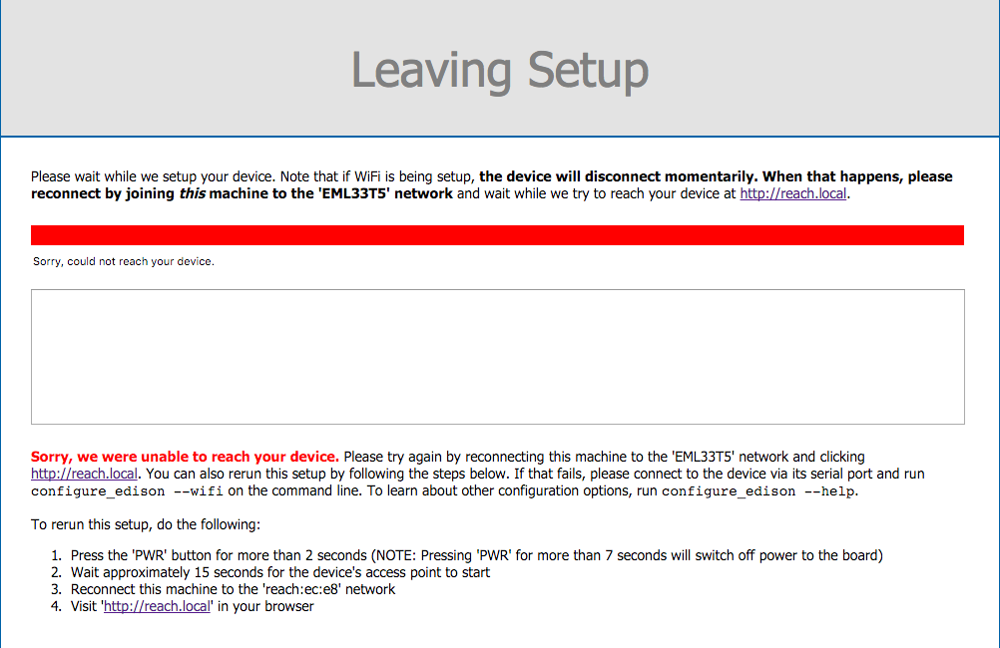

### Only Single solution in RTK mode

1) Check that rover has a connection to a base station and that it is receiving the corrections.

2) Make sure that the rover sees minimum 5 satellites with high SNR level (45-50).

3) Check that there are 5 common satellites between the rover and the base station with high SNR level (45-50).

### Only Float solution in RTK mode

1) Make sure that rover sees minimum 5 satellites with high SNR level (45-50).

2) There has to be at least 5 common satellites between the rover and the base station with high SNR level (45-50).

3) Check that baseline length (distance between the rover and the base station) is less than 10km.

### Unable to connect to Reach-hosted Wi-Fi access point

This problem appears to be tied to Reach image v1.1. Please, reflash the device with the [latest image](firmware-reflashing.md).

### Wi-Fi setup ends with an error message

When trying to connect Reach to your network via network setup, after you hit the "Submit" button, you will see a progress bar. You **should not** wait for the progress bar to reach it's end. **That sometimes ends with an error message which is irrelevant and misleading**. Don't wait for more than 30 seconds, as it's usually more than enough for the device to reconnect to a new network.

### “Reach.local” unreachable

1) Try to determine whether Reach is connected to your network(Detailed guide can be found [here](reachview-basics.md).

2) Try to connect to ReachView via an IP address(make sure this is Reach's IP and it's pingable)

3) Check the LED statuses. Normal pattern consists of four or five lights, starting with white. If you can't see that, then ReachView probably exited with failure. Try rebooting the device.

### Resetting broken default configs

You can reset default configs via the three dot menu in the Config tab.

### Updating ReachView (and resetting in case of misconfiguration)

Starting from v0.0.3, ReachView update process includes an animation. If, for some reason, the update process failed and ReachView is not accessible after update(resolving the address after server restart takes some time). Try rebooting the device. If even that does not help, consider [reflashing](firmware-reflashing.md).